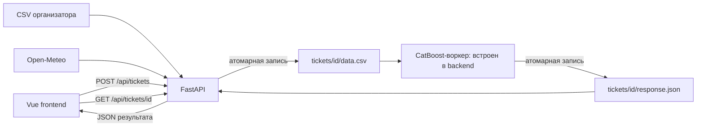

# Прогноз выработки ВЭС — HackAlem AI

**Трек:** Энергетика · **Команда:** Порнофильмы

[Веб-интерфейс](https://hackalem-pornofilms.polandcentral.cloudapp.azure.com) · [Контракт backend](back/README.md) · [Контракт ML](ml/README.md) · [Сторонние компоненты](DISCLOSURE.md)

> **Запуск из репозитория.** Исходные CSV, две обученные CatBoost-модели и модельный воркер включены в main. При запуске backend воркер включается автоматически: отдельный процесс ML и личные API-ключи не нужны. Установка и проверка приведены в разделах 4–8. Измеренная точность на реальных архивных прогнозах погоды пока не заявляется.

## 1. Описание решения и назначение

Сервис предназначен для инженера или аналитика ветроэлектростанции: выбрать турбину и дату, получить прогноз на 48 часов и исследовать выбранный интервал на графике. Прогноз нужен для планирования ожидаемой выработки и оценки её изменений при обновлении погоды.

Пользователь задаёт турбину, начало прогноза и число предшествующих дней контекста. Backend собирает погодные признаки из исходного датасета и открытого API, формирует задание для Python-модели и возвращает её результат интерфейсу. Длина расчёта всегда 48 часов; отображаемый интервал выбирается во frontend.

Задача хакатона — историческое воспроизведение прогнозов за **1–28 февраля 2026 года**, начиная с расчёта 31 января и далее последовательно по датам. Для каждого расчёта допустимы только сведения, доступные на соответствующий момент. Полный февральский прогон с реальной моделью ещё не подтверждён.

### Данные

Исходные CSV организатора находятся в [back/data/](back/data/) и входят в репозиторий. Дополнительное скачивание с личных аккаунтов участников не требуется.

| Турбина | Координаты | Строк в исходном CSV |
| --- | --- | --- |
| A — turbine 1 | 43.645150, 78.535604 | 142 360 |
| B — turbine 2 | 43.643198, 78.538828 | 149 499 |

Фактический диапазон файлов: **11.03.2023–31.01.2026**. Поля: время, средняя скорость ветра, нормализованная активная мощность и температура. Нативный шаг — 10 минут; возможны пропуски. Февральских целевых значений мощности в этих файлах нет.

Backend передаёт модели только погодные признаки и временные метки. Мощность используется как целевой признак при обучении, но не как вход при прогнозировании. Результат — 48 почасовых значений нормализованной активной мощности в диапазоне [0, 1]. Это не MW, не MWh и не измеренный КПД турбины.

Для каждой турбины используется своя CatBoost-модель с 80 признаками: история и статистики погоды, будущая погода, календарь и номер прогнозного часа. Модели обучены по 31.01.2026 включительно. Их рабочие прогнозы начинаются с 01.02.2026; более ранние даты требуют отдельных оценочных моделей.

## 2. Архитектура



```text
frontend/   интерфейс, карта, графики и HTTP-клиент
back/       API, подготовка данных, настройки, зависимости, тесты и deployment
inference/  модельный воркер, две CatBoost-модели и проверяемый manifest
ml/         описание интерфейса обмена с моделью
problem/    обучение, эксперименты, оценочные модели и отчёты
tickets/    временный обмен заданиями и результатами
```

- Frontend получает начальные настройки через /api/bootstrap, создаёт задание и опрашивает его примерно раз в секунду.
- Backend берёт доступную погоду из CSV, заполняет недостающие интервалы через Open-Meteo и публикует готовый data.csv.
- Встроенный ML-воркер автоматически замечает готовый data.csv, проверяет вход, выполняет прогноз и атомарно публикует response.json. Backend возвращает этот JSON без изменения структуры. Файловая блокировка предотвращает повторную одновременную обработку.
- request.json и база истории запросов не используются. Активная подготовка хранится в памяти; опубликованные файлы переживают перезапуск backend. Результаты удаляются после настраиваемого периода хранения.

Модель получает файл с колонками:

```csv
timestamp,phase,turbine_id,wind_speed_ms,temperature_c,weather_source
```

phase отделяет историю от прогнозного интервала; timestamp содержит UTC-смещение. Мощность и MWh в этот файл не включаются.

ML_STEP задаётся только в настройках backend. При ML_STEP=6 получается одна строка каждые 10 минут. Нативные измерения сохраняются; интернет-прогнозы с часовым шагом интерполируются, что отмечается в weather_source. Это не новые независимые измерения погоды. Модель агрегирует вход на часовую сетку, сохраняя исходные целочасовые значения прогноза провайдера.

Текущая модель использует **последние 168 часов погоды — семь суток**. history_days меньше 7 автоматически расширяется backend до 7; более длинный CSV допустим, но модель берёт только последние семь дней. Выход всегда почасовой, независимо от ML_STEP.

## 3. Используемые технологии

| Компонент | Технологии |
| --- | --- |
| Backend | Python, FastAPI, Pydantic, Uvicorn, HTTPX, tzdata |
| Frontend | Vue 3, Vite, Leaflet, ECharts, vue-echarts, Lucide |
| ML runtime | CatBoost 1.2.10, NumPy 2.4.6, pandas 3.0.6; CPU, без обучения при запросе |
| Погода | Open-Meteo: архивные и текущие прогнозы GFS |
| Обмен с ML | CSV и JSON в общей файловой системе; атомарное переименование |
| Проверки | pytest; сборка frontend через npm |
| Публикация | Caddy, HTTPS, systemd на Ubuntu |

Архивные lead-offset значения выбираются с консервативным запасом по времени доступности. Точные исторические моменты публикации каждого погодного запуска этим способом не подтверждены. Метод и допущения описаны в [backend README](back/README.md).

Автоматизированы получение погоды, подготовка входа, запуск модели, проверка структуры/полноты данных и выдача результата. Проверяются SHA-256 модельных файлов, входная сетка, границы контекста, полнота 48 часов и конечность выходных чисел.

Новый подтверждённый запрос запускает новый расчёт. Самостоятельное отслеживание изменения погодного прогноза без нового запроса не реализовано. Полный последовательный февральский прогон и точность на архивной прогнозной погоде ещё требуют отдельной проверки. Обучение использовало фактически записанную будущую погоду; такие экспериментальные метрики не равны качеству при использовании неточных погодных прогнозов.

## 4. Инструкции по установке

### Системные требования

- Python **3.11 или 3.12**; backend проверен на Python 3.11.4.
- Node.js **22.12+** и npm; сборка проверена на Node.js 22.22.3 / npm 10.9.8.
- Git, доступ на запись в back/.cache/ и tickets/.
- Интернет для установки пакетов, погодного API и картографических тайлов.
- GPU не нужен: встроенные CatBoost-модели исполняются на CPU. Число параллельных заданий и потоков модели настраивается.

Команды далее выполняются **из корня репозитория**.

```sh
git clone https://github.com/BAITC-Hacks/hack-8e676a69-team.git
cd hack-8e676a69-team
```

### Windows / PowerShell

```powershell
python -m venv back/.venv
./back/.venv/Scripts/python.exe -m pip install -r back/requirements.txt
Copy-Item back/.env.example back/.env
npm.cmd --prefix frontend ci
npm.cmd --prefix frontend run build
```

### Linux / macOS

```sh
python3 -m venv back/.venv
back/.venv/bin/python -m pip install -r back/requirements.txt
cp back/.env.example back/.env
npm --prefix frontend ci
npm --prefix frontend run build
```

Для нового клона используются два исходных CSV из back/data/. Не переименовывайте их суффиксы turbine 1.csv и turbine 2.csv. Для другого расположения укажите DATASETS_DIR в back/.env.

Для проверки прогнозов по архивной погоде установите **USE_DATASET_FOR_HORIZON=false** в back/.env. Значение true оставлено для отдельного теста модели с известной погодой внутри исходного датасета.

## 5. Инструкции по запуску

### Интерфейс и backend

Сначала выполните сборку frontend из раздела 4. Затем запустите backend.

Windows:

```powershell
./back/.venv/Scripts/python.exe -m uvicorn back.main:app --env-file back/.env --host 127.0.0.1 --port 8000
```

Linux / macOS:

```sh
back/.venv/bin/python -m uvicorn back.main:app --env-file back/.env --host 127.0.0.1 --port 8000
```

Откройте **http://127.0.0.1:8000/**. FastAPI раздаёт собранный frontend и API с одного адреса. Интерактивная документация API: **http://127.0.0.1:8000/docs**.

Для разработки можно отдельно запустить npm run dev в frontend/; Vite проксирует /api в backend на порту 8000. При изменении backend-конфигурации перезапустите процесс.

### ML-воркер и модельные файлы

При INFERENCE_ENABLED=true, установленном по умолчанию, **backend запускает воркер автоматически**. Команды выше поднимают и HTTP API, и обработку тикетов моделью. Переобучение для запуска не требуется.

В репозиторий включены:

- [inference/models/turbine_1/catboost.cbm](inference/models/turbine_1/catboost.cbm);
- [inference/models/turbine_2/catboost.cbm](inference/models/turbine_2/catboost.cbm);
- [inference/models/manifest.json](inference/models/manifest.json) — признаки, обучающий cutoff и контрольные суммы.

При старте проверяется согласованность модели и manifest. Для стандартного демонстрационного запуска problem/ не является runtime-зависимостью.

При необходимости отдельного процесса установите INFERENCE_ENABLED=false в back/.env. Во втором терминале из корня репозитория выполните:

Windows:

```powershell
./back/.venv/Scripts/python.exe -m inference.main --watch --env-file back/.env
```

Linux / macOS:

```sh
back/.venv/bin/python -m inference.main --watch --env-file back/.env
```

Оба процесса должны использовать один TICKETS_DIR и TURBINE_TIMEZONE. Подробная спецификация находится в [inference/README.md](inference/README.md).

### Развёртывание на VM

Файлы конфигурации находятся в [back/deploy/](back/deploy/). Systemd запускает backend из /data/app/back/.venv, читает /data/app/back/.env; Caddy обслуживает HTTPS и направляет запросы на localhost:8000. По умолчанию модельный воркер запускается этим же backend и использует /data/app/tickets.

Публичный интерфейс — дополнительный способ просмотра. Для технической проверки остаются необходимыми воспроизводимые локальные инструкции и все модельные артефакты в итоговой версии.

## 6. Необходимые зависимости и сторонние материалы

- [back/requirements.txt](back/requirements.txt) — runtime-зависимости backend.
- [back/requirements-dev.txt](back/requirements-dev.txt) — зависимости автотестов.
- [inference/requirements.txt](inference/requirements.txt) — закреплённые ML runtime-зависимости; устанавливаются автоматически через back/requirements.txt.
- [problem/requirements-training.txt](problem/requirements-training.txt) — дополнительные зависимости для обучения и экспериментов; для демонстрационного запуска не нужны.
- [frontend/package.json](frontend/package.json) и [package-lock.json](frontend/package-lock.json) — frontend; установка через npm ci.
- [Исходные CSV](back/data/) — данные организатора по двум турбинам.
- [Open-Meteo Previous Runs](https://open-meteo.com/en/docs/previous-runs-api) и [Forecast API](https://open-meteo.com/en/docs) — источники интернет-погоды.
- [DISCLOSURE.md](DISCLOSURE.md) — библиотеки, данные, подготовленная инфраструктура и использование AI-инструментов.

Frontend, backend и модельный воркер не требуют личных подписок участников или ключей платных AI-сервисов. Для внешней погоды нужен доступ в интернет. Сохранённые модели входят в репозиторий; inference не скачивает веса и не обращается к платному сервису.

Методика обучения и описание экспериментальных результатов находятся в [problem/WEATHER_CONTEXT_MODELS.md](problem/WEATHER_CONTEXT_MODELS.md). Для воспроизведения обучения можно установить problem/requirements-training.txt и запустить problem/train_weather.py из корня репозитория. Этот процесс не требуется для обычного прогноза.

## 7. Параметры окружения

Настройки backend задаются в back/.env; пример — [back/.env.example](back/.env.example). **Относительные пути отсчитываются от back/** независимо от каталога запуска.

| Переменная | Значение по умолчанию | Назначение |
| --- | --- | --- |
| TURBINE_TIMEZONE | Asia/Almaty | Интерпретация исходных временных меток и дат без смещения |
| DATASETS_DIR | ./data | Каталог исходных CSV |
| TICKETS_DIR | ../tickets | Общий каталог backend и ML |
| INFERENCE_ENABLED | true | Автоматический запуск воркера внутри backend |
| INFERENCE_MODEL_DIR | ../inference/models | Каталог весов и manifest |
| INFERENCE_WORKERS | 2 | Параллельные модельные задания |
| INFERENCE_THREADS | 1 | CPU-потоки на один прогноз |
| ML_STEP | 6 | Число строк входа на час; 6 означает 10 минут |
| WEATHER_CACHE_DIR | ./.cache/weather | Кэш ответов погоды |
| WEATHER_MODEL | gfs_global | Погодная модель |
| WEATHER_WIND_VARIABLE | wind_speed_100m | Переменная ветра; высота должна соответствовать методике ML |
| USE_DATASET_FOR_HORIZON | true | Погода из CSV внутри прогнозного интервала; для архивного backtest — false |
| FORECAST_AVAILABILITY_MARGIN_HOURS | 12 | Запас при выборе архивного lead-offset |
| WEATHER_TIMEOUT_SECONDS | 25 | Тайм-аут одного запроса погоды |
| TICKET_TIMEOUT_SECONDS | 1800 | Ожидание ответа ML |
| RESULT_TTL_SECONDS | 1800 | Хранение готового ответа для получения frontend |
| MAX_ACTIVE_TICKETS | 32 | Максимум активных заданий |
| CORS_ORIGINS | * | Разрешённые origins frontend; перечисляются через запятую |
| WEB_DIST | ../frontend/dist | Каталог собранного интерфейса |

TURBINE_TIMEZONE=Asia/Almaty — принятое местное время, UTC+5 для февраля 2026 года. Исходные CSV не указывают timezone, поэтому это явное допущение реализации.

Frontend использует необязательную VITE_API_BASE_URL при сборке из frontend/.env. Для общей точки входа http://127.0.0.1:8000 значение должно отсутствовать или быть пустым.

## 8. Порядок проверки основного сценария

1. Откройте /health локального backend: ожидается JSON с ok=true. Один HTTP 200 с HTML не подтверждает работу API.
2. Откройте /api/bootstrap: ожидаются турбины A/B, диапазоны дат, prediction_hours=48 и defaults с тремя полями.
3. В интерфейсе явно выберите турбину A и дату 2026-02-05, затем подтвердите создание задания в диалоге. Либо выполните POST /api/tickets через /docs:

```json
{
  "turbine_id": "A",
  "horizon_start": "2026-02-05",
  "history_days": 30
}
```

4. Ожидается HTTP 202 и ticket_id. Backend публикует tickets/<id>/data.csv: при ML_STEP=6 это **4 320 строк истории + 288 прогнозных строк**. История — 6 января–4 февраля; прогноз — 5–6 февраля. Колонок мощности/MWh быть не должно.
5. Встроенный воркер автоматически публикует response.json. GET /api/tickets/<id> должен вернуть HTTP 200 с массивом series: одна серия agent-ctboost, 48 точек hour=0…47, конечные value в [0,1]. Интерфейс должен отобразить эту серию. Час 0 — интервал от начала прогноза до начала+1ч; час 47 — последний интервал полного 48-часового окна.
6. Повторите для турбины B и другой даты. Для проверки всего задания нужен отдельный последовательный февральский прогон с сохранёнными моментами выпуска, целевыми часами и результатами. Он пока не подтверждён.

Успех сценария — реальные 48 модельных точек и соответствующий график, а не один HTTP 200. Ошибка модели возвращается как JSON error; значения не подменяются тестовыми прогнозами. Предсказания — нормализованная мощность, не MWh. Даты раньше 01.02.2026 отклоняются финальной моделью, чтобы не выдавать обучение на будущих данных за историческую проверку.

### Автоматические проверки

Windows:

```powershell
./back/.venv/Scripts/python.exe -m pip install -r back/requirements-dev.txt
./back/.venv/Scripts/python.exe -m pytest -c back/pytest.ini back/tests -q
```

Linux / macOS:

```sh
back/.venv/bin/python -m pip install -r back/requirements-dev.txt
back/.venv/bin/python -m pytest -c back/pytest.ini back/tests -q
```

Тесты проверяют границы интервалов, серверное управление шагом, отсутствие целевой мощности во входе, интерполяцию, HTTP-опрос, атомарную публикацию, ошибки, перезапуск и очистку. Дополнительные интеграционные проверки запускают сохранённые CatBoost-модели на автономных погодных данных и проверяют встроенный/отдельный воркер, часовую агрегацию, блокировки и точный формат результата. Они проверяют интеграцию, а не точность реальной прогнозной погоды.

**Проверено на текущей интеграции:** 49 backend/inference-тестов пройдены; npm ci и production-сборка frontend выполнены. Локальный запуск по указанной команде проверен вместе с /health, /api/bootstrap, собранным интерфейсом и API-документацией.

Для обеих турбин выполнен реальный HTTP-сценарий: начало 05.02.2026, history_days=30, ML_STEP=6, USE_DATASET_FOR_HORIZON=false. Вход собран из CSV организатора и архивного погодного API; встроенный CatBoost-воркер вернул по 48 конечных почасовых значений, часы 0–47. Проверено совпадение HTTP-ответа с опубликованным response.json. Тестовые ответы модели в этом прогоне не использовались.

Февральские MAE/RMSE не заявляются: в исходных файлах нет февральских целевых значений. Для измерения качества необходимы отдельная временная выборка, не использованная при обучении, и одинаковые единицы прогнозов и фактических значений.
