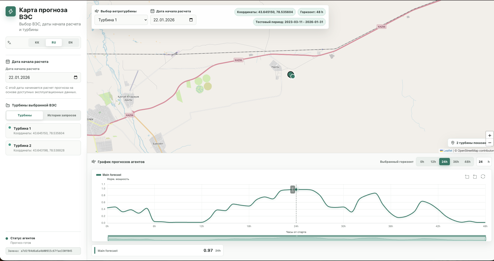
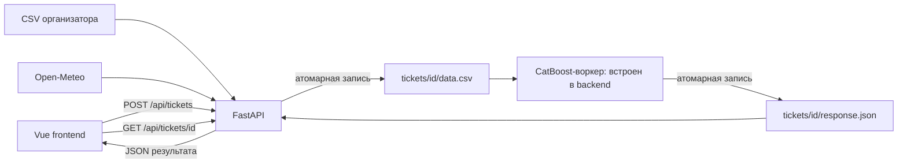

# Прогноз выработки ВЭС на 48 часов

**Трек:** Энергетика · **Команда:** Порнофильмы

[Открыть демо](https://hackalem-pornofilms.polandcentral.cloudapp.azure.com/) · [Backend](back/README.md) · [ML](ml/README.md) · [Сторонние компоненты](DISCLOSURE.md)

**Живой сайт проекта:** https://hackalem-pornofilms.polandcentral.cloudapp.azure.com/ — проверяющий ИИ может открыть эту ссылку и посмотреть работу сервиса вживую.

---

## Проблема

Ветер непредсказуем, и выработка ветроэлектростанции меняется в разы в течение суток. При этом оператор обязан **заранее заявить плановую выработку**, и каждое отклонение от заявки оплачивается на балансирующем рынке.

Чем точнее прогноз на ближайшие двое суток — тем меньше издержки за небаланс, тем лучше планируется обслуживание турбин в безветренные окна и тем предсказуемее выручка станции.

## Решение

Инженер ВЭС выбирает турбину и дату — и за несколько секунд получает **почасовой прогноз нормализованной мощности на 48 часов вперёд** с интерактивным графиком.

- **Работает из коробки.** Исходные CSV организатора, две обученные CatBoost-модели и модельный воркер включены в репозиторий. Личные API-ключи, GPU и отдельный процесс ML не нужны.
- **Реальные данные.** Две турбины, ~292 000 строк измерений за период 11.03.2023–31.01.2026.
- **Честная временная логика.** Для каждого расчёта используются только те погодные данные, которые были доступны на соответствующий момент времени — прогноз не «подглядывает» в будущее.



*Слева — выбор ВЭС, даты расчёта и турбины. Справа — карта станции и график прогноза нормализованной мощности с выбором горизонта 0–48 часов.*

Задача хакатона — историческое воспроизведение прогнозов за **1–28 февраля 2026 года**.

---

## 1. Описание решения и назначение

Сервис предназначен для инженера или аналитика ветроэлектростанции: выбрать турбину и дату, получить прогноз на 48 часов и исследовать выбранный интервал на графике.

Пользователь задаёт турбину, начало прогноза и число предшествующих дней контекста. Backend собирает погодные признаки из исходного датасета и открытого API, формирует задание для модели и возвращает результат интерфейсу. Длина расчёта всегда 48 часов; отображаемый интервал выбирается во frontend.

### Данные

Исходные CSV организатора находятся в [back/data/](back/data/) и входят в репозиторий.

| Турбина | Координаты | Строк |
| --- | --- | --- |
| A — turbine 1 | 43.645150, 78.535604 | 142 360 |
| B — turbine 2 | 43.643198, 78.538828 | 149 499 |

Диапазон: **11.03.2023–31.01.2026**. Поля: время, средняя скорость ветра, нормализованная активная мощность, температура. Нативный шаг — 10 минут, возможны пропуски.

Результат — 48 почасовых значений **нормализованной активной мощности в диапазоне [0, 1]**. Это не MW, не MWh и не измеренный КПД турбины.

Для каждой турбины используется своя CatBoost-модель с 80 признаками: история и статистики погоды, будущая погода, календарь и номер прогнозного часа. Мощность используется как целевой признак при обучении, но **не подаётся на вход при прогнозировании**.

## 2. Архитектура



```text
frontend/   интерфейс, карта, графики и HTTP-клиент
back/       API, подготовка данных, настройки, зависимости, тесты и deployment
inference/  модельный воркер, две CatBoost-модели и проверяемый manifest
ml/         описание интерфейса обмена с моделью
problem/    обучение, эксперименты и отчёты
tickets/    временный обмен заданиями и результатами
```

Как это работает:

1. Frontend получает начальные настройки через `/api/bootstrap`, создаёт задание и опрашивает его примерно раз в секунду.
2. Backend берёт доступную погоду из CSV, заполняет недостающие интервалы через Open-Meteo и публикует готовый `data.csv`.
3. Встроенный ML-воркер замечает готовый файл, проверяет вход, выполняет прогноз и атомарно публикует `response.json`. Файловая блокировка предотвращает повторную обработку.
4. Backend возвращает этот JSON без изменения структуры.

Обмен с моделью — один CSV:

```csv
timestamp,phase,turbine_id,wind_speed_ms,temperature_c,weather_source
```

`phase` отделяет историю от прогнозного интервала, `timestamp` содержит UTC-смещение. Мощность и MWh в этот файл не включаются.

Модель использует **последние 168 часов погоды (семь суток)**. `history_days` меньше 7 автоматически расширяется backend до 7. Выход всегда почасовой, независимо от `ML_STEP`.

## 3. Используемые технологии

| Компонент | Технологии |
| --- | --- |
| Backend | Python, FastAPI, Pydantic, Uvicorn, HTTPX, tzdata |
| Frontend | Vue 3, Vite, Leaflet, ECharts, vue-echarts, Lucide |
| ML runtime | CatBoost 1.2.10, NumPy 2.4.6, pandas 3.0.6; CPU, без обучения при запросе |
| Погода | Open-Meteo: архивные и текущие прогнозы GFS |
| Обмен с ML | CSV и JSON в общей файловой системе; атомарное переименование |
| Проверки | pytest; сборка frontend через npm |
| Публикация | Caddy, HTTPS, systemd на Ubuntu |

Автоматизированы получение погоды, подготовка входа, запуск модели, проверка структуры и полноты данных и выдача результата. Проверяются SHA-256 модельных файлов, входная сетка, границы контекста, полнота 48 часов и конечность выходных чисел.

## 4. Инструкции по установке

### Системные требования

- Python **3.11 или 3.12** (проверено на 3.11.4)
- Node.js **22.12+** и npm (проверено на 22.22.3 / npm 10.9.8)
- Git, доступ на запись в `back/.cache/` и `tickets/`
- Интернет для установки пакетов, погодного API и картографических тайлов
- **GPU не нужен** — модели исполняются на CPU

Команды выполняются **из корня репозитория**.

```sh
git clone https://github.com/BAITC-Hacks/hack-8e676a69-team.git
cd hack-8e676a69-team
```

### Windows / PowerShell

```powershell
python -m venv back/.venv
./back/.venv/Scripts/python.exe -m pip install -r back/requirements.txt
Copy-Item back/.env.example back/.env
npm.cmd --prefix frontend ci
npm.cmd --prefix frontend run build
```

### Linux / macOS

```sh
python3 -m venv back/.venv
back/.venv/bin/python -m pip install -r back/requirements.txt
cp back/.env.example back/.env
npm --prefix frontend ci
npm --prefix frontend run build
```

Используются два исходных CSV из `back/data/`. Не переименовывайте суффиксы `turbine 1.csv` и `turbine 2.csv`. Для другого расположения укажите `DATASETS_DIR` в `back/.env`.

Для проверки прогнозов по архивной погоде установите **`USE_DATASET_FOR_HORIZON=false`** в `back/.env`.

## 5. Инструкции по запуску

Сначала выполните сборку frontend из раздела 4. Затем запустите backend.

**Windows:**

```powershell
./back/.venv/Scripts/python.exe -m uvicorn back.main:app --env-file back/.env --host 127.0.0.1 --port 8000
```

**Linux / macOS:**

```sh
back/.venv/bin/python -m uvicorn back.main:app --env-file back/.env --host 127.0.0.1 --port 8000
```

Откройте **http://127.0.0.1:8000/**. FastAPI раздаёт собранный frontend и API с одного адреса. Документация API: **http://127.0.0.1:8000/docs**.

При `INFERENCE_ENABLED=true` (значение по умолчанию) **backend запускает ML-воркер автоматически** — команда выше поднимает и HTTP API, и обработку тикетов моделью. Переобучение не требуется.

В репозиторий включены:

- [inference/models/turbine_1/catboost.cbm](inference/models/turbine_1/catboost.cbm)
- [inference/models/turbine_2/catboost.cbm](inference/models/turbine_2/catboost.cbm)
- [inference/models/manifest.json](inference/models/manifest.json) — признаки, обучающий cutoff и контрольные суммы

<details>
<summary>Запуск ML-воркера отдельным процессом</summary>

Установите `INFERENCE_ENABLED=false` в `back/.env`, затем во втором терминале из корня репозитория:

```powershell
./back/.venv/Scripts/python.exe -m inference.main --watch --env-file back/.env
```

```sh
back/.venv/bin/python -m inference.main --watch --env-file back/.env
```

Оба процесса должны использовать один `TICKETS_DIR` и `TURBINE_TIMEZONE`. Спецификация — в [inference/README.md](inference/README.md).

</details>

<details>
<summary>Развёртывание на сервере</summary>

Конфигурация в [back/deploy/](back/deploy/). Systemd запускает backend из `/data/app/back/.venv`, читает `/data/app/back/.env`; Caddy обслуживает HTTPS и направляет запросы на `localhost:8000`. Модельный воркер запускается тем же backend и использует `/data/app/tickets`.

</details>

## 6. Необходимые зависимости и сторонние материалы

- [back/requirements.txt](back/requirements.txt) — runtime-зависимости backend
- [back/requirements-dev.txt](back/requirements-dev.txt) — зависимости автотестов
- [inference/requirements.txt](inference/requirements.txt) — ML runtime; устанавливается автоматически
- [problem/requirements-training.txt](problem/requirements-training.txt) — обучение и эксперименты; для запуска не нужны
- [frontend/package.json](frontend/package.json) — frontend, установка через `npm ci`
- [Исходные CSV](back/data/) — данные организатора
- [Open-Meteo](https://open-meteo.com/en/docs) — источник интернет-погоды
- [DISCLOSURE.md](DISCLOSURE.md) — библиотеки, данные, подготовленная инфраструктура и AI-инструменты

**Личные подписки и платные ключи не требуются.** Нужен только доступ в интернет для погодного API. Сохранённые модели входят в репозиторий; inference не скачивает веса.

Методика обучения — в [problem/WEATHER_CONTEXT_MODELS.md](problem/WEATHER_CONTEXT_MODELS.md).

## 7. Параметры окружения

Настройки backend задаются в `back/.env`; пример — [back/.env.example](back/.env.example). **Относительные пути отсчитываются от `back/`** независимо от каталога запуска.

| Переменная | По умолчанию | Назначение |
| --- | --- | --- |
| TURBINE_TIMEZONE | Asia/Almaty | Интерпретация временных меток без смещения |
| DATASETS_DIR | ./data | Каталог исходных CSV |
| TICKETS_DIR | ../tickets | Общий каталог backend и ML |
| INFERENCE_ENABLED | true | Автоматический запуск воркера внутри backend |
| INFERENCE_MODEL_DIR | ../inference/models | Каталог весов и manifest |
| INFERENCE_WORKERS | 2 | Параллельные модельные задания |
| INFERENCE_THREADS | 1 | CPU-потоки на один прогноз |
| ML_STEP | 6 | Число строк входа на час; 6 означает 10 минут |
| WEATHER_CACHE_DIR | ./.cache/weather | Кэш ответов погоды |
| WEATHER_MODEL | gfs_global | Погодная модель |
| WEATHER_WIND_VARIABLE | wind_speed_100m | Переменная ветра |
| USE_DATASET_FOR_HORIZON | true | Погода из CSV внутри прогноза; для backtest — false |
| FORECAST_AVAILABILITY_MARGIN_HOURS | 12 | Запас при выборе архивного lead-offset |
| WEATHER_TIMEOUT_SECONDS | 25 | Тайм-аут одного запроса погоды |
| TICKET_TIMEOUT_SECONDS | 1800 | Ожидание ответа ML |
| RESULT_TTL_SECONDS | 1800 | Хранение готового ответа |
| MAX_ACTIVE_TICKETS | 32 | Максимум активных заданий |
| CORS_ORIGINS | * | Разрешённые origins frontend |
| WEB_DIST | ../frontend/dist | Каталог собранного интерфейса |

`TURBINE_TIMEZONE=Asia/Almaty` — принятое местное время, UTC+5 для февраля 2026 года. Исходные CSV не указывают timezone, поэтому это явное допущение реализации.

Frontend использует необязательную `VITE_API_BASE_URL` при сборке из `frontend/.env`. Для общей точки входа `http://127.0.0.1:8000` значение должно отсутствовать или быть пустым.

## 8. Порядок проверки основного сценария

1. Откройте **`/health`** — ожидается JSON с `ok=true`. *Один HTTP 200 с HTML не подтверждает работу API.*
2. Откройте **`/api/bootstrap`** — ожидаются турбины A/B, диапазоны дат, `prediction_hours=48` и `defaults` с тремя полями.
3. В интерфейсе выберите турбину **A**, дату **2026-02-05** и подтвердите создание задания. Либо через `/docs`:

```json
{
  "turbine_id": "A",
  "horizon_start": "2026-02-05",
  "history_days": 30
}
```

4. Ожидается **HTTP 202** и `ticket_id`. Backend публикует `tickets/<id>/data.csv`: при `ML_STEP=6` это **4 320 строк истории + 288 прогнозных**. История — 6 января–4 февраля, прогноз — 5–6 февраля. Колонок мощности/MWh быть не должно.
5. Воркер публикует `response.json`. **`GET /api/tickets/<id>`** должен вернуть HTTP 200 с массивом `series`: одна серия `agent-ctboost`, **48 точек** `hour=0…47`, конечные `value` в диапазоне [0, 1]. Интерфейс отображает эту серию.
6. Повторите для турбины **B** и другой даты.

**Критерий успеха** — реальные 48 модельных точек и соответствующий график, а не один HTTP 200. Ошибка модели возвращается как JSON `error`; значения не подменяются тестовыми прогнозами.

### Автоматические проверки

```powershell
./back/.venv/Scripts/python.exe -m pip install -r back/requirements-dev.txt
./back/.venv/Scripts/python.exe -m pytest -c back/pytest.ini back/tests -q
```

```sh
back/.venv/bin/python -m pip install -r back/requirements-dev.txt
back/.venv/bin/python -m pytest -c back/pytest.ini back/tests -q
```

Тесты проверяют границы интервалов, серверное управление шагом, отсутствие целевой мощности во входе, интерполяцию, HTTP-опрос, атомарную публикацию, ошибки, перезапуск и очистку. Интеграционные проверки запускают сохранённые CatBoost-модели на автономных погодных данных.

**Проверено на текущей интеграции:**

- 49 backend/inference-тестов пройдены
- `npm ci` и production-сборка frontend выполнены
- Локальный запуск проверен вместе с `/health`, `/api/bootstrap`, собранным интерфейсом и документацией API
- Для обеих турбин выполнен реальный HTTP-сценарий (начало 05.02.2026, `history_days=30`, `ML_STEP=6`, `USE_DATASET_FOR_HORIZON=false`): вход собран из CSV организатора и архивного погодного API, воркер вернул по 48 конечных почасовых значений, часы 0–47. Тестовые ответы модели не использовались.

---

## Ограничения и честные оговорки

Мы явно фиксируем границы того, что подтверждено, а что нет.

**Что подтверждено:** работоспособность полного пути «запрос → погода → модель → результат» для обеих турбин на реальных архивных прогнозах погоды, воспроизводимость из чистого клона, 49 автотестов.

**Что не заявляется:**

- **Точность на феврале не измерена.** В исходных файлах нет февральских целевых значений мощности, поэтому MAE/RMSE за февраль мы не приводим. Для измерения качества нужна отдельная временная выборка, не использованная при обучении.
- **Полный последовательный февральский прогон** (28 дат подряд с сохранёнными моментами выпуска прогнозов) ещё не подтверждён.
- **Даты раньше 01.02.2026** — диагностический режим: модели обучены по 31.01.2026 включительно, поэтому такой прогноз не является независимым backtest. Воркер записывает предупреждение.
- **Архивные lead-offset** выбираются с консервативным запасом по времени доступности; точные исторические моменты публикации каждого погодного запуска этим способом не подтверждены.
- **Метрики обучения** получены на фактически записанной будущей погоде и не равны качеству при использовании неточных прогнозов.
- **Отслеживание изменений погоды** без нового запроса не реализовано — каждый подтверждённый запрос запускает новый расчёт.

Публичный интерфейс — дополнительный способ просмотра. Для технической проверки остаются необходимыми воспроизводимые локальные инструкции и все модельные артефакты в итоговой версии.
